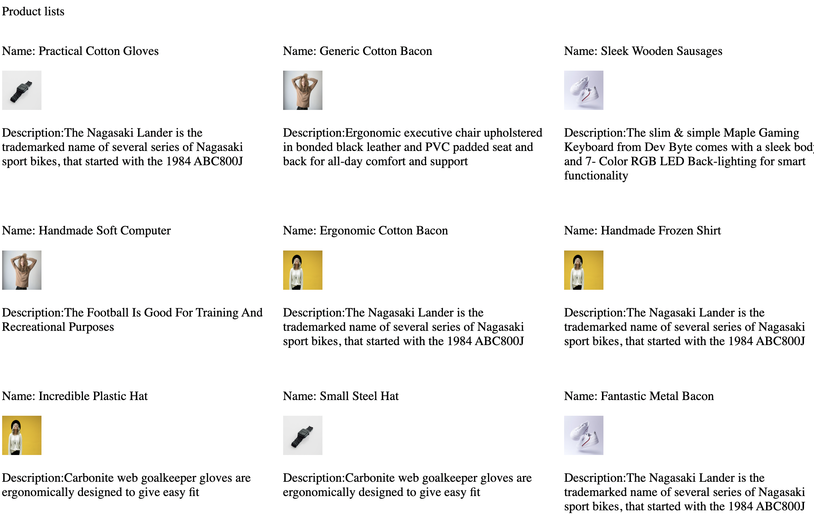

# Homework requirements

1. get data using fetch or axios in the fetchData.js file
2. display data to the index.html file
3. add style to the style.css file (the style is up to you - be creative)

Here is a example with no CSS:

